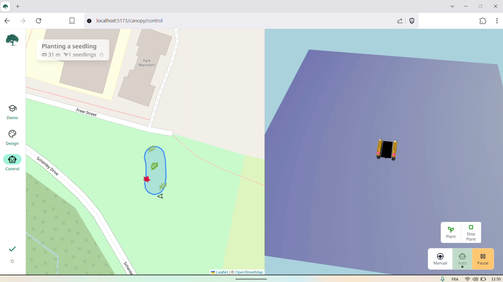

> [!NOTE]  
> Canopy is no longer being developed by Will Heitman for Arbor Robotics and it has been archived.

# Canopy


## Overview

Canopy is a web interface used to plan forests and send plans to Steward, a reforestation robot. Canopy was written using SvelteKit, Tailwind, roslibjs, and Bits UI.

## Developing

Once you've created a project and installed dependencies with `npm install` (or `pnpm install` or `yarn`), start a development server:

```bash
npm run dev

# or start the server and open the app in a new browser tab
npm run dev -- --open
```

## Building

To create a production version of your app:

```bash
npm run build
```

You can preview the production build with `npm run preview`.

> To deploy your app, you may need to install an [adapter](https://kit.svelte.dev/docs/adapters) for your target environment.

## ROS considerations

### Coordinate conversions
ROS's map frame uses the ENU convention. That is, **x is east, y is north, z is up**.
THREE.js's convention is: **x is east, y is up, z is south**.


